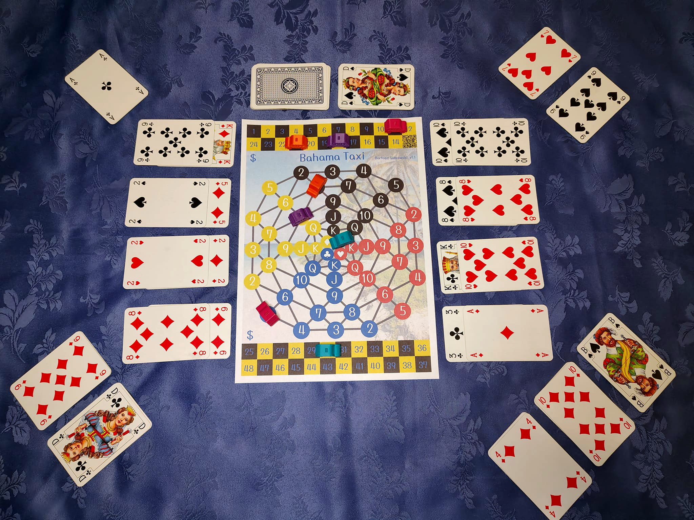

# "Bahama Taxi" Board Game

## Playing instructions

Game rules v1.1, 2026-04-24.

### Introduction

The game is played by 2 to 4 players, who become taxi drivers in some city. They compete to gather the highest income by carrying passengers.

Required stuff:

- the board
- standard 52-card deck
- distinguishable pieces (a matching pair for each player)

### Board

The board depicts a scheme of road connections in a city. It consists of 52 areas, enumerated with card symbols. On each of four parts of the board there are areas for distinct card suit (♠, ♥, ♣, ♦). Congested city core, called Downtown, is reflected by areas in the middle of the board, enumerated with ranks (A, K, Q, J).

Along the edges of the board there is an income tracker for each player — a checkered strip of fields styled after the distinctive black-and-yellow taxi markings.

Two given areas are adjacent, whenever they are connected with line or touch themselves. Example pairs of adjacent areas.

- 5♦, 2♠
- D♠, A♠
- A♣, K♣

Example pairs of areas, that are not adjacent:

- 3♥, 5♥
- A♠, A♣

### Taxi movement

Each player controls one taxi. A taxi is represented by a piece placed on a board area. Only a single piece is allowed to occupy given area.

Players take turns. On his turn, player can move his taxi to any unoccupied adjacent area or stay in place.

### Passengers

Citizens nature has nothing to do with hurry. Whenever one of them wants to get from area X to area Y, he take his time waiting on X for any taxi to pick him up. Then he travel until dropped off at his destination Y. Passengers give no suggestions about taxi route and leave it all to the driver.

A player receive fares for getting a passenger to his final destination, proportional to the distance between areas X and Y. The distance is measured as a number of taxi movements needed to get from X to Y via the shortest route. Neither actual route nor driving time affects fares at all.

Any citizen, who is trying to catch a taxi or travel as a passenger, is represented by a pair of cards, lying face up one on another. The bottom card stands for area X, while the top one for area Y.

A pair of cards for citizen waiting on area X is placed by the board, on the X color side. A pair of cards for citizen being a passenger of given player taxi is placed in front of the player. A pair of cards for citizen who has been dropped off at final destination is discarded on the discard pile.

A taxi can carry up to 3 passengers at one time. A player can pick up a citizen with his taxi on the end of his turn, if the taxi is placed on the same area the citizen is waiting. A player can drop off a citizen on the end of his turn, if the taxi is placed on the same area the citizen is travelling to.

### Ingame situation example

Comments:

- Player A can move his taxi to area 6♦ and pick up the citizen waiting there as a third passenger.
- Player A can move his taxi to area 9♠ and drop off one of passengers.
- Player B can move his taxi to area 2♦. He can't pick up the waiting citizen, because he is already carrying three passengers.
- Player C can't move taxi to area 10♦, because it is occupied by another taxi.
- Player C can wait on area 8♠ and pick up waiting citizen as a third passenger.
- Player D can't move taxi to area A♣, because it is not adjacent to area A♠.

| area, where a citizen is waiting for taxi | destination area | fare |
|---|---|---|
| 8♠ | 8♥ | 3 |
| 10♠ | 10♣ | 4 |
| K♣ | 10♥ | 2 |
| 3♣ | A♦ | 5 |
| K♦ | 9♣ | 3 |
| 5♦ | 2♠ | 1 |
| 2♦ | 2♥ | 7 |
| 6♦ | 8♦ | 2 |

### Random element in game

At the begining of a play, whole deck is shuffled and placed face down by the board, becoming the draw pile.

Each player discover initial position for his taxi, drawing a card from draw pile. Used cards are discarded face up on the discard pile.

A citizen waiting for a taxi is added by drawing a pair of cards from the draw pile and placing it properly by the board. This way 8 citizens are added initially. Whenever any citizen is picked up by a taxi, next random citizen is added, if only there are enough cards at the draw pile.

### Final phase of game

Since the draw pile runs out of cards, a player is not permitted to pick up third passenger. He can still carry three passengers if they have been picked up already.

Since there are no more than 4 citizens waiting for a taxi, a player is not permitted to pick up second passenger. He can still carry two passengers if they have been picked up already.

At the moment there are no citizens waiting for a taxi, the game is over and players' income is compared. A player do not receive any income for passengers left in his taxi.
