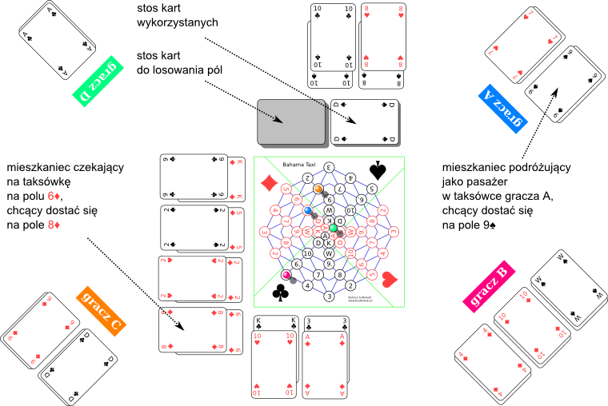

# Gra planszowa "Bahama Taxi"

## Instrukcja

Zasady gry v1.1, 2026-04-24.

### Wprowadzenie

W grze bierze udział od 2 do 4 graczy, którzy wcielają się w rolę kierowców taksówek w pewnym mieście. Zadaniem każdego z nich jest uzyskanie jak najwyższego zarobku z przewozu pasażerów.

Do gry potrzebne są:

- plansza
- standardowa talia 52 kart do gry
- po parze pionków dla każdego gracza

### Plansza

Schemat połączeń drogowych w mieście przedstawia załączona plansza. Plansza składa się z 52 pól ponumerowanych kartami do gry. Na każdej z czterech części planszy znajdują się pola dla innego koloru kart (♠, ♥, ♣, ♦). Zatłoczone centrum miasta odzwierciedlone jest przez pola na środku planszy, ponumerowane figurami (A, K, D, W).

Na brzegach planszy znajduje się licznik zarobku dla każdego gracza — szachownica pól stylizowana na charakterystyczny czarno-żółty wzór oznaczenia taksówek.

Dwa pola sąsiadują ze sobą, jeśli są połączone linią lub się stykają. Przykładowe pary sąsiadujących pól:

- 5♦, 2♠
- D♠, A♠
- A♣, K♣

Przykładowe pary pól, które nie sąsiadują ze sobą:

- 3♥, 5♥
- A♠, A♣

### Poruszanie się taksówek

Każdy gracz kieruje jedną taksówką. Taksówki są reprezentowane w grze przez pionki stojące na polach planszy. Na danym polu może znajdować się jednocześnie tylko jedna taksówka.

Gracze poruszają taksówkami, wykonując kolejno po jednym ruchu. W swoim ruchu gracz może jechać taksówką na sąsiednie wolne pole albo stać taksówką w miejscu.

### Przewóz pasażerów

Mieszkańcy miasta, w którym toczy się gra, nie mają w swej naturze nic z pośpiechu. Gdy chcą dostać się z pola X na pole Y, najpierw cierpliwie czekają na polu X na dowolną taksówkę, która zabierze ich jako pasażera. Następnie spokojnie podróżują, aż zostaną wysadzeni na docelowym polu Y. Pasażerowie nie mają ambicji dysponowania taksówką na wyłączność i bezpośredniego wpływu na jej trasę. Z wielką wyrozumiałością przyjmują poczyniania kierowcy, pozostawiając mu całkowitą swobodę prowadzenia taksówki.

Za przewiezienie pasażera przysługuje wynagrodzenie, proporcjonalne do odległości między polami X i Y. Odległość ta mierzona jest jako liczba ruchów potrzebnych taksówce do przejechania z X do Y najkrótszą trasą. Faktyczna trasa ani czas przejazdu taksówki nie mają żadnego wpływu na wynagrodzenie.

Każdy czekający na taksówkę lub podróżujący jako pasażer mieszkaniec jest reprezentowany w grze przez 2 karty, leżące odkryte jedna na drugiej. Karta na spodzie wskazuje pole X, a karta na wierzchu pole Y. Karty mieszkańców czekających na taksówkę kładzie się obok planszy, przy brzegu właściwym dla koloru pola, na którym czekają. Karty mieszkańców podróżujących jako pasażerowie w taksówce danego gracza kładzie się przed tym graczem. Karty mieszkańców, którzy zostali wysadzeni na docelowym polu, odkłada się na stos kart wykorzystanych.

Taksówka może przewozić jednocześnie do trzech pasażerów. Gracz może zabrać mieszkańca jako pasażera, jeżeli na koniec ruchu jego taksówka znajduje się na polu, gdzie dany mieszkaniec czeka. Gracz może wysadzić pasażera i pobrać wynagrodzenie, jeżeli na koniec ruchu jego taksówka znajduje się na polu, dokąd dany pasażer chciał się dostać.

### Przykładowa sytuacja w trakcie gry

Komentarz do załączonej sytuacji:

- Gracz A może jechać taksówką na pole 6♦ i zabrać czekającego tam mieszkańca jako trzeciego pasażera.
- Gracz A może jechać taksówką na pole 9♠ i wysadzić pasażera.
- Gracz B może jechać taksówką na pole 2♦. Nie może jednak zabrać czekającego tam mieszkańca, ponieważ ma już komplet trzech pasażerów.
- Gracz C nie może jechać taksówką na pole 10♦, ponieważ jest ono zajęte przez inną taksówkę.
- Gracz C może stać taksówką w miejscu na polu 8♠ i zabrać czekającego tam mieszkańca jako trzeciego pasażera.
- Gracz D nie może jechać taksówką na pole A♣, ponieważ pole A♠ z nim nie sąsiaduje.

| pole, na którym mieszkaniec czeka na taksówkę | pole, na które mieszkaniec chce się dostać | wynagrodzenie przysługujące za przewóz |
|---|---|---|
| 8♠ | 8♥ | 3 |
| 10♠ | 10♣ | 4 |
| K♣ | 10♥ | 2 |
| 3♣ | A♦ | 5 |
| K♦ | 9♣ | 3 |
| 5♦ | 2♠ | 1 |
| 2♦ | 2♥ | 7 |
| 6♦ | 8♦ | 2 |

### Losowy element w grze

Na początku gry cała talia kart jest tasowana i kładziona zakrytą stroną tuż obok planszy. W ten sposób powstaje stos kart do losowania pól.

Gracze losują początkowe pola swoich taksówek, ciągnąc po jednej karcie ze stosu kart do losowania pól. Karty te są następnie odkładane odkrytą stroną na stosie kart wykorzystanych.

Mieszkańcy czekający na taksówkę są losowani przez pociągnięcie dwóch kart ze stosu kart do losowania pól i położenie ich odpowiednio obok planszy. W ten sposób wylosowanych zostaje 8 mieszkańców. W momencie, gdy mieszkaniec czekający na taksówkę zostaje zabrany jako pasażer, na jego miejsce jest losowany kolejny, o ile na stosie kart do losowania pól jest wystarczająco dużo kart.

### Końcowa faza gry

Od chwili, gdy wyczerpie się stos kart do losowania pól, nie można zabrać do taksówki trzeciego pasażera. W taksówce może wciąż znajdować się trzech pasażerów, o ile zostali oni zabrani wcześniej.

Gdy pozostało już tylko 4 lub mniej mieszkańców czekających na taksówkę, nie można zabrać do taksówki drugiego pasażera. W taksówce może wciąż znajdować się dwóch pasażerów, o ile zostali oni zabrani wcześniej.

W momencie, gdy nie pozostał żaden mieszkaniec czekający na taksówkę, gra natychmiast kończy się i porównywane są uzyskane zarobki graczy. Wynagrodzenie za pasażerów, których gracze nie zdążyli przewieźć, przepada w całości.
